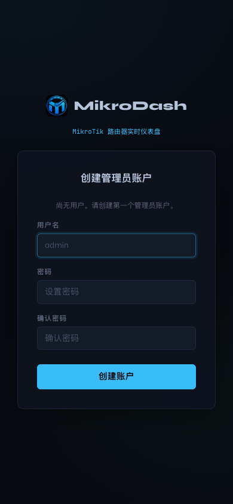

# 首版验证记录

日期：2026-09-15。官方基线 v0.8.55，中文发布源码提交 `de153fd`。

- [Chinese UI checks：完整检查通过](https://github.com/pcg562240/MikroDash/actions/runs/34937576371)。
- 中文层 18 项测试通过：显示文案、提交值与字段标识隔离、动态表达式及转义保留、占位符校验、资源权限字段保留、HTML 控件结构一致、品牌名保留，以及安装阶段不生成源码副本。
- 官方前端 48 项测试通过；官方后端 `go test ./...` 通过。
- 官方业务源码与基线提交核验通过；原版和中文前端类型检查、中文前端构建通过。
- 本地 Docker 镜像构建和空数据实例启动已验证；浏览器检查首次管理员创建、登录、中文连接向导、设置页面，未出现 JavaScript 页面错误。
- 检查桌面 1440 × 1000 与手机 390 × 844；截图使用模拟管理员/空数据，没有连接真实路由器。
- 设置页截图为布局检查：在测试浏览器内隐藏了首次连接引导及断开连接的遮罩，以便查看表单。未修改后台权限或提交路由器配置。它不是生产联网功能验收。
- 曾发现 npm 的 `prepare` 生命周期自动生成副本，导致上游路径核验误扫描生成的测试文件；已改为显式构建命令并补测试，没有删除或跳过上游失败门禁。

## 手机界面

| 创建管理员 | 常规设置（空数据布局检查） |
| --- | --- |
|  |  |

## 发布验证

[中文镜像发布成功](https://github.com/pcg562240/MikroDash/actions/runs/34937577886)。未提供登录凭据的 GHCR 拉取授权及 manifest 请求返回 HTTP 200，确认公开可访问；manifest 包含 `linux/amd64` 与 `linux/arm64`。

```text
ghcr.io/pcg562240/mikrodash-zh:0.8.55-zh.1
sha256:1f59ccda017743e90188184ffe584c8585565f8cc0bb196af732428390aacaf5
```

## 更新机制验证

[上游检查首次运行成功](https://github.com/pcg562240/MikroDash/actions/runs/34937263069)，当前已与官方最新稳定版一致，因此没有创建无意义的升级 PR。未来出现新 release 后的合并冲突、文案变化和真实升级 PR 仍需维护者审核，不将本次“无新版本”检查等同于未来升级保证。

## 未验收范围

- 未替换 NAS 生产容器，未迁移生产数据库。
- 未在真实 RouterOS 上执行任何写操作或逐项功能验收。
- 不是所有运行时错误、原始日志、第三方插件文案都已翻译。
- 没有承诺自动解决未来上游的代码冲突或协议变化。
