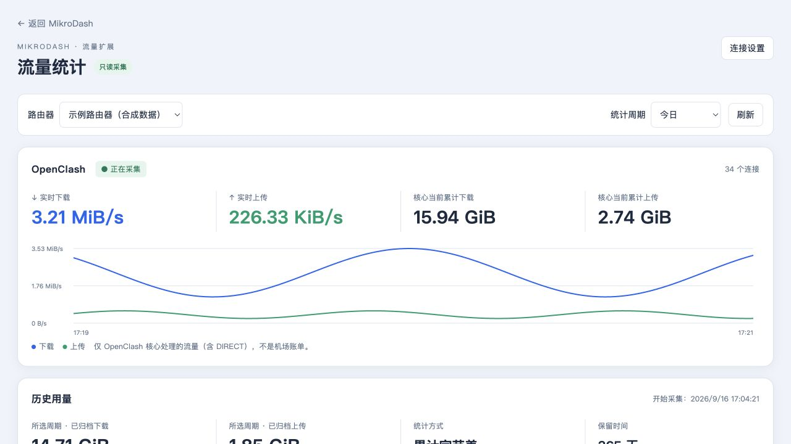
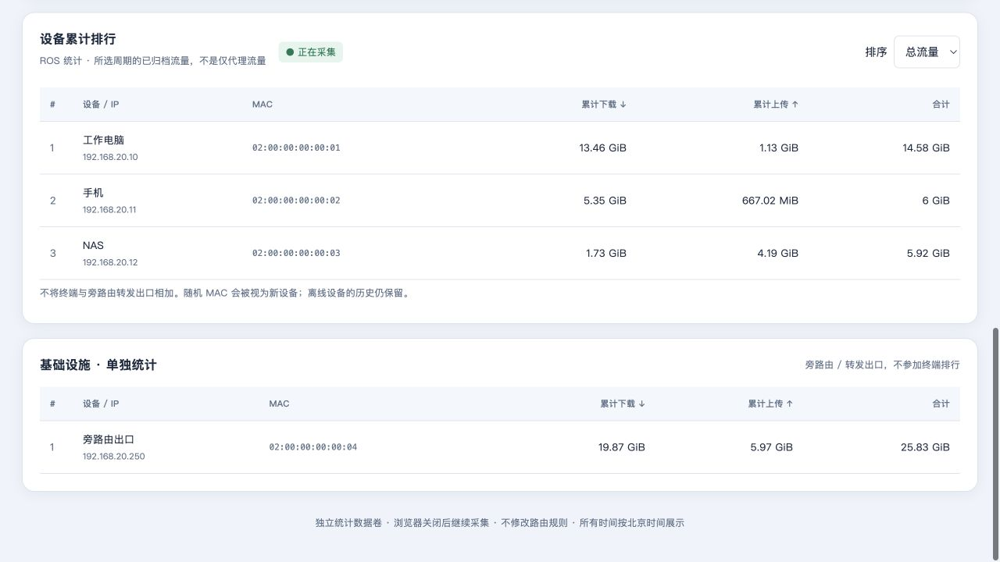
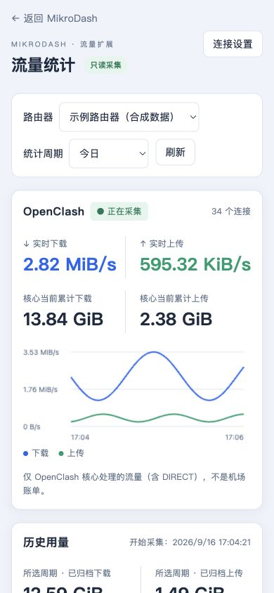

# MikroDash 流量扩展（第一期）

独立于中文汉化层的可选模块。**不是上游内置功能，不是机场账单，不修改 ROS/OpenClash 配置。**

## 已实现

- 仪表盘顶部 OpenClash 实时卡片及详情入口。
- 核心实时上传/下载（B/s）、最近两分钟曲线、当前全局字节计数、连接数。
- 今日、昨日、本月、保留期累计、自定义日期；按小时查看归档量。
- ROS Kid Control 每设备下载/上传/合计排行，IP/MAC、离线设备历史。
- 基础设施 IP/MAC 单独列表，避免将终端与旁路由出口重复求和。
- 后台常驻采集、SQLite 独立持久化、365 天分钟历史清理。
- MikroDash 登录会话、router:read/router:history 和设置管理权限检查；密钥不回显。

## 架构与边界

```text
浏览器 → traffic 网关 :3083 → 原 MikroDash dashboard:3081
                   ├─ /extensions/traffic/       统计界面
                   ├─ /api/traffic-extension/*   受登录与路由器权限保护
                   └─ 后台只读采集
                       ├─ Mihomo GET /traffic、GET /connections
                       └─ ROS API /ip/kid-control/device/print、/ip/arp/print
```

- 网关不挂载或读取 MikroDash 的生产 `/data`；统计账号由管理员独立填写，可使用现有只读 API 账号。不会自动创建 ROS 账号、启用服务或添加 Kid Control 配置。
- 配置页需要 `manageSettings` 和目标路由器 `manageable`；实时接口需要 `readable`；历史接口另外需要 `history`。匿名、权限缺失或上游验证失败均拒绝。
- 凭据用独立 AES-GCM 密钥加密后存入统计数据库，`.key` 权限 0600。浏览器只收到“是否已保存”，没有取回明文的接口；端点改变时不把旧密码自动转发到新地址。
- 控制器仅接受内网/回环 IP 字面量（不支持主机名），只发固定 GET 路径，不跟随重定向。OpenClash token 本身仍可能有管理权限，因此不得暴露到前端，也不要把 9090 开到公网。
- 默认验证 HTTPS/API-SSL 证书。ROS 可显式选择不验证自签名证书，不建议用于不可信网络；本模块不改设备证书。
- 原业务源码与 Go 模块文件保持上游基线。`adapter.mjs` 仅修改新建的隔离构建副本，通过一个 dashboard 初始化锚点挂载 iframe。锚点变化会构建失败，需要人工审查，而不是静默忽略。

## 统计口径（必须保留）

1. OpenClash 总量包含核心处理的 DIRECT，排除绕过核心的流量；与 WAN 总量重叠，不相加。
2. 历史量来自**累计计数器差值**，不是瞬时速度积分。首次收到的已有计数只作为基线，不塞进“今日”。
3. 每条新连接/采集会话、计数下降或长采集间隙重新建基线，并标记缺口。已入库历史不丢失，但缺口期间流量不猜测、不补造。
4. 核心接口没有本模块可依赖的稳定进程 ID；重连与计数下降是保守边界，不宣称计费级审计或所有未观察到的重置均可辨识。ROS 重连也采用相同保守策略。
5. 分钟边界按时间比例分配当前采样差值，小时/日聚合以此为基础；字节总数守恒，但边界时刻是估算。使用 NAS UTC 时间入库、北京时间展示，不使用 ROS 本地时钟。
6. “保留期累计”是最近 365 天已归档量，不是终身累计。核心当前计数另列，重启/重置可能归零。
7. ROS 设备以 MAC 识别。随机 MAC 是新设备；IP 变化不新建设备。多 IP 的 MAC 标注“多个地址”，此时用 MAC 指定基础设施。重复 MAC 统计行被明确报错，避免双算。
8. 不将 OpenClash 统一 SNAT 源地址强行拆分到设备；本期不做“每设备仅代理流量”账单。
9. 一份统计数据卷只运行一个采集实例。禁用/重启会留下可见的采样缺口；修改源端点后历史仍保留在关联路由器下。

## 本地构建与预览

仓库根目录运行：

```sh
docker compose -f docker-compose.traffic.yml build
docker compose -f docker-compose.traffic.yml up -d
```

访问 `http://127.0.0.1:3084`，先完成新预览实例的 MikroDash 初始化，再在仪表盘顶部点击“查看详情 → 连接设置”。这是独立预览卷，不使用已有实例数据。

两份镜像分开构建：

```sh
docker build -f Dockerfile.traffic --target dashboard -t mikrodash-traffic-dashboard:preview .
docker build -f Dockerfile.traffic --target collector -t mikrodash-traffic-collector:preview .
```

工具镜像内仍使用与 `localization/upstream.json` 匹配的官方后端。依赖下载较慢时可以在构建命令添加 `--build-arg GOPROXY=https://goproxy.cn,https://proxy.golang.org,direct`；保持 Go checksum 验证开启，不改 go.mod/go.sum。

## 连接设置

- **关联路由器**：从现有 MikroDash 列表选择，作为权限与统计归属标识。
- **OpenClash 控制器地址**：例如 `http://OPENCLASH_IP:9090`（替换为实际内网 IP），API secret 单独输入。
- **ROS Host / API 端口 / 用户名 / 密码**：使用既有账号，建议专用只读 API；启用 API-SSL 时相应使用正确端口与证书。
- **基础设施列表**：旁路由 WAN IP 或 MAC，一行一个。只影响展示分组，不删除历史、不限制联网。
- 勾选“启用持续采集”后保存。某个来源地址留空则不采集该来源；取消整体启用可暂停采集。
- 密钥/密码留空保持原值；用显式清除选项删除保存值。不更改路由器侧密码。

## NAS / Portainer 发布与迁移

**已发布：0.8.55-traffic.1**。两个公开镜像均支持 `linux/amd64`、`linux/arm64`，已核验匿名拉取。固定版本与 digest 见 [发布记录](../../docs/zh-CN/TRAFFIC-RELEASE-0.8.55.md)。不要把纯汉化镜像与扩展采集器当作完整扩展界面组合。

`preview` 是本机镜像标签，不是 NAS 能直接拉取的公开镜像。正式发布使用独立的 **Publish traffic extension images** 工作流，版本为 `上游版本-traffic.修订号`；不修改纯汉化版 `latest`。

Portainer image-only Stack 模板见 [`docker-compose.traffic.release.yml`](../../docker-compose.traffic.release.yml)。部署前须核验对应工作流成功、两份镜像公开且支持目标架构，并将两个数据目录占位符替换为实际目录；源码模板本身不表示发布已成功。

正式部署仍需单独确认：

- 浏览器端口只映射到 `traffic` 网关；`dashboard` 不额外暴露宿主端口。
- 原 MikroDash 数据与统计数据分开持久化，互不共享可写数据库。
- 迁移前备份原数据；同一份 MikroDash 可写 `/data` 不同时运行两个容器，也不直接拿生产卷做测试。
- 统计的 `.key`、`traffic.db` 必须一起备份。最简单的一致备份方式是暂停统计容器后备份完整统计卷；保留 WAL/SHM 状态或使用 SQLite 在线备份工具。
- 回滚界面时恢复旧镜像/原 Stack；保留统计卷，避免历史与密钥被删除。停止网关时原服务的访问入口也需相应恢复。

## 测试

```sh
go test -race ./extensions/traffic/...
go vet ./extensions/traffic/...
npm test --prefix extensions/traffic
node localization/verify-upstream.mjs
node localization/cli.mjs prepare /tmp/MIKRODASH_TRANSLATED_OUTPUT
node extensions/traffic/adapter.mjs /tmp/MIKRODASH_TRANSLATED_OUTPUT
web/node_modules/.bin/tsc --noEmit -p /tmp/MIKRODASH_TRANSLATED_OUTPUT/web/tsconfig.json
go run ./cmd/webbuild -dir /tmp/MIKRODASH_TRANSLATED_OUTPUT/web
```

输出目录必须是全新目录。全量 Go 回归请在干净 worktree 运行，避免旧隔离前端副本影响上游源码路径扫描。

`dev/mock-sources.py` 仅绑定回环地址，提供合成 Mihomo/ROS API，用于 UI QA；不在生产镜像启动，不访问真实网络设备。示例 token/账号不是生产凭据。

完整检查结果见 [本地验收记录](../../docs/zh-CN/TRAFFIC-VALIDATION.md)。

界面预览（全部为合成设备和流量）：




